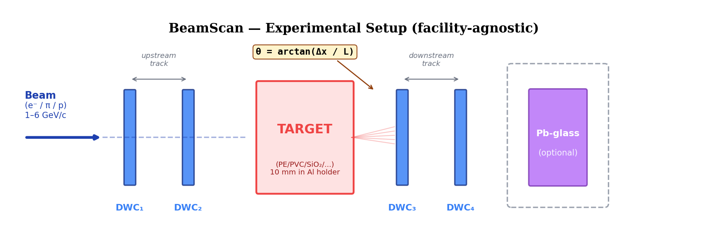

<!-- _class: divider -->
<!-- _paginate: false -->

# Technical Deep Dive

What the code actually does — for project owners

7 source files · 2 CI pipelines · 3 analysis scripts · 11 materials

---

# Geant4 — Detector Geometry



| Component | Material | Size | Purpose |
|-----------|----------|------|---------|
| **DWCs** (×4) | Ar/CO₂ 80/20 gas (10 mm gap) | 10 × 10 cm² | Measure particle direction before/after target |
| **Target** | Configurable via macro | 10 × 10 cm², variable thickness | Material under study |
| **Calorimeter** | PbO lead glass | 15 × 15 × 30 cm³ | Energy measurement (optional extension) |
| **World** | Air | 3 × 3 × 3 m³ | Contains all volumes |

<div class="sm">

> **Key:** One binary runs all 22 configurations. Macro commands `/beamscan/target/material` and `/beamscan/target/thickness` reconfigure the target between runs — no recompilation needed.

</div>

<div class="footer">Los Topos Cósmicos · BL4S 2026 · Technical Deep Dive</div>

---

# Geant4 — Physics List & Per-Event Data

<div class="cols">
<div class="card card-blue">

### Physics List: FTFP_BERT + option4

**FTFP_BERT:** Fritiof + Bertini cascade
- Handles hadronic interactions (p, π, n)
- Nuclear elastic + inelastic scattering
- *This is why G4 gives 12% more than Highland*

**EM option4:** most accurate MCS model
- G4UrbanMscModel for electrons
- G4WentzelVIModel for hadrons
- Step limiter ensures small steps in target

</div>
<div class="card card-green">

### What happens per event

1. `ParticleGun` fires e⁻ at z = −80 cm
2. Particle traverses DWC1 → DWC2
   *(SteppingAction records first hit per plane)*
3. Particle enters **TARGET** → MCS happens
4. Particle exits → DWC3 → DWC4
5. Particle hits Calorimeter → energy deposited
6. `EventAction` computes all angles + momenta
7. `EndOfEventAction` writes row to CSV ntuple

</div>
</div>

<div class="footer">Los Topos Cósmicos · BL4S 2026 · Technical Deep Dive</div>

---

# Geant4 — The 9-Column Ntuple

<div class="sm">

| Column | Unit | How computed | Used for |
|--------|------|-------------|----------|
| `theta3D_mrad` | mrad | `acos(inDir · outDir)` | Full 3D scattering angle |
| `thetaX_mrad` | mrad | `atan2` difference in x-z plane | **Primary classification observable** |
| `thetaY_mrad` | mrad | `atan2` difference in y-z plane | Cross-check / 2D analysis |
| `pIn_GeV` | GeV | Momentum at DWC2 (before target) | Beam energy verification |
| `pOut_GeV` | GeV | Momentum at DWC3 (after target) | Energy loss measurement |
| `deltaP_MeV` | MeV | pIn − pOut | dE/dx spectroscopy |
| `xTarget_mm` | mm | Interpolated x position at target plane | Beam profile |
| `yTarget_mm` | mm | Interpolated y position at target plane | Beam profile |
| `caloEdep_MeV` | MeV | Total energy deposited in lead glass | Particle ID (future) |

</div>

> **9 columns per event** — enough for MCS classification AND momentum-loss spectroscopy. Students can mine this data for multiple physics analyses beyond the primary classification.

<div class="footer">Los Topos Cósmicos · BL4S 2026 · Technical Deep Dive</div>

---

# Geant4 — Multi-Threading & Output Format

<div class="cols">
<div class="card card-blue">

### MT-Mode Architecture

Geant4 11.3.2 auto-detects CPU cores.
GitHub Actions runner: **4 cores → 4 threads**.

Each thread writes its own CSV file:

```
events_nt_beamscan_t0.csv
events_nt_beamscan_t1.csv
events_nt_beamscan_t2.csv
events_nt_beamscan_t3.csv
```

`ActionInitialization.cc` creates per-thread copies of `RunAction` + `EventAction` + `SteppingAction`.

⚠️ Deleting `ActionInitialization` breaks MT mode — this is the exact regression ChatGPT introduced.

</div>
<div class="card card-orange">

### WCSV Format (not standard CSV!)

Geant4 writes `#class tools::wcsv::ntuple` headers with metadata, **not a plain CSV**.

Our parser (`analyze_geant4.py`) handles:
- `#separator` line → detects delimiter
- `#column` lines → extracts column names
- Data lines → splits and zips into dicts

**Why this matters:**
`pandas.read_csv()` **fails** on Geant4 output. Our custom `read_wcsv_file()` handles both wcsv and standard CSV formats.

Thread merging: glob `*_t*.csv` → concatenate all rows → 2,000 events = 500/thread × 4.

</div>
</div>

<div class="footer">Los Topos Cósmicos · BL4S 2026 · Technical Deep Dive</div>

---

# Analysis Pipeline — From Raw Events to Classification

<div class="flow">
<div class="flow-step" style="border-top-color: var(--blue);">

**1. Raw CSV**
θx, θy, θ3D,
pIn, pOut, ΔP,
x, y, Ecalo
per event

</div>
<div style="align-self: center; font-size: 1.2em; color: var(--muted);">→</div>
<div class="flow-step" style="border-top-color: var(--teal);">

**2. Core Cut**
Remove tails:
keep central 95%
(2.5→97.5 pctl)
Mitigate nuclear
scattering outliers

</div>
<div style="align-self: center; font-size: 1.2em; color: var(--muted);">→</div>
<div class="flow-step" style="border-top-color: var(--green);">

**3. Gaussian Fit**
σ_core = std(core)
μ_core = mean(core)
This is the G4
"measured" σ

</div>
<div style="align-self: center; font-size: 1.2em; color: var(--muted);">→</div>
<div class="flow-step" style="border-top-color: var(--gold);">

**4. Highland Match**
Load predictions.csv
Match material_pGeV
Compute ratio:
G4_σ / Highland_θ₀

</div>
<div style="align-self: center; font-size: 1.2em; color: var(--muted);">→</div>
<div class="flow-step" style="border-top-color: var(--orange);">

**5. Outputs**
Bar plot
Comparison table
CSV data
SUMMARY.md

</div>
</div>

<div class="card card-blue" style="margin-top: 16px;">

### Why the Core Cut Matters

MCS produces a **Gaussian core + non-Gaussian tails**. The tails come from: (a) nuclear elastic scattering (large single kicks), (b) nuclear inelastic events (secondaries), (c) delta rays. Highland predicts only the Gaussian core, so we cut the tails for a fair comparison.

**The 12% excess even after cutting tails** tells us the core itself is wider than Highland predicts — that's nuclear elastic scattering broadening the Gaussian, not just tail events. For Fe₂O₃ it's 40–50% — genuine strong-interaction physics visible in the data.

</div>

<div class="footer">Los Topos Cósmicos · BL4S 2026 · Technical Deep Dive</div>

---

# Highland Calculator — The Analytic Engine

<div class="cols">
<div>

### The Formula (PDG 2024)

$$\theta_0 = \frac{13.6 \text{ MeV}}{p\beta c}\sqrt{\frac{x}{X_0}}\left[1 + 0.038\ln\frac{x}{X_0}\right]$$

### `compute_predictions()` does:

1. Look up $X_0$, $\rho$ from `MATERIALS_DB`
2. Or accept **student-provided** $X_0$/$\rho$ in YAML *(custom materials!)*
3. Compute $\theta_0$ via Highland formula
4. Estimate $dE/dx \approx 2 \text{ MeV/(g/cm²)} \times \rho \times x$
5. Store result: $\theta_0$, dE, $X_0$, $\rho$, $p$, thickness
6. For all material pairs: $N_{3\sigma} = 2(3\sigma_{avg}/\Delta\theta)^2$ → events needed for 3σ separation

</div>
<div>

### Output Files

<div class="card card-purple">

**`predictions.csv`** — 11 materials × 2 momenta = 22 rows
Columns: name, g4name, category, X₀, ρ, thickness, p, θ₀, dE

**`distributions.png`** — Gaussian curves overlaid for all materials

**`classification.png`** — 2D plot: θ₀(3 GeV) vs θ₀(6 GeV) with 1/p line and cluster annotations

**`SUMMARY.md`** — Table + pair separations + N_events

</div>

### Custom Material Power

If a student provides `X0_cm` and `rho` in their YAML, the calculator accepts it — even for materials not in the database. Students learn by researching $X_0$ from PDG tables.

</div>
</div>

<div class="footer">Los Topos Cósmicos · BL4S 2026 · Technical Deep Dive</div>

---

# CI/CD — Two Pipelines, Two Purposes

<div class="cols">
<div class="card card-teal">

### ⚡ Highland CI (~30 sec)

**Triggers:** PR touching `requests/*.yaml`, push to main, or manual dispatch

**Steps:**
1. Checkout repo
2. `pip install pyyaml jsonschema matplotlib`
3. Validate YAML against JSON schema
4. Run `highland_calculator.py`
5. Upload `predictions/` as artifact
6. If PR: **post comment with plots + table** (uses `actions/github-script`)
7. If push to main: commit `results/`

**Key features:**
- Posts inline images in PR — students see plots without downloading
- `validate_requests.py` checks against `schemas/request.schema.json` → prevents malformed/malicious YAML

</div>
<div class="card card-blue">

### ⚛️ Geant4 CI (~20 min)

**Triggers:** manual dispatch only *(too expensive for every PR)*

**Steps:**
1. Checkout repo
2. Install Miniforge (conda)
3. `conda install geant4` (11.3.2) + cmake, gcc, matplotlib, scipy
4. `cmake + make beamscan`
5. `generate_macros.py` → 22 `.mac` files
6. `run_all.sh` → runs all 22 simulations (500 events × 4 threads = 2000 each)
7. `highland_calculator.py` → predictions
8. `analyze_geant4.py` → comparison plots
9. Upload `geant4_output/` as artifact
10. `git commit results/geant4_comparison/` with `[skip ci]` tag
    `git pull --rebase` + push

</div>
</div>

<div class="footer">Los Topos Cósmicos · BL4S 2026 · Technical Deep Dive</div>

---

# Macro Generation & Scattering Computation

<div class="cols">
<div>

### `generate_macros.py`

Reads student YAML → writes one `.mac` per material × momentum:

```bash
# Auto-generated: PE_3.0GeV_10.0mm.mac
/run/initialize
/gun/particle e-
/gun/energy 3.0 GeV
/beamscan/target/material G4_POLYETHYLENE
/beamscan/target/thickness 10.0 mm
/beamscan/output/filename \
  geant4_output/PE_3.0GeV_10.0mm/events
/run/beamOn 2000
```

Plus `run_all.sh`:
```bash
for f in macros_auto/*.mac; do
  ./build/beamscan "$f"
done
```

</div>
<div>

### The Scattering Angle Computation

`SteppingAction` records first hit per DWC → position + momentum at each plane.

`EventAction::EndOfEventAction` computes:

```
inDir  = (pos[DWC2] − pos[DWC1]).unit()
outDir = (pos[DWC4] − pos[DWC3]).unit()

θ_3D = acos(inDir · outDir)
θ_x  = atan2(out.x, out.z) − atan2(in.x, in.z)
θ_y  = atan2(out.y, out.z) − atan2(in.y, in.z)
```

Only events hitting **all 4 DWCs** are kept (natural acceptance cut).

> This is the exact same method a real BL4S team would use with Delay Wire Chambers (DWCs) — the simulation mirrors the real analysis.

</div>
</div>

<div class="footer">Los Topos Cósmicos · BL4S 2026 · Technical Deep Dive</div>

---

# Bugs Found & Fixed — Engineering Story

<div class="sm">

| Severity | Bug | Root Cause | Fix |
|----------|-----|-----------|-----|
| <span class="badge-red badge">CRITICAL</span> | **X₀ Values Wrong (4 materials)** | PVC, CaCO₃, Al₂O₃, Fe₂O₃ had X₀ in g/cm² instead of cm. Highland overpredicted PVC (physically impossible). | Recomputed using Tsai formula + PDG cross-checks |
| <span class="badge-orange badge">HIGH</span> | **PET/PE Substring Collision** | `"PE" in "PET_3.0GeV"` → `True` in Python. Highland matching grabbed PE's value for PET. | `m.startswith(material + "_")` instead of `in` |
| <span class="badge badge">MEDIUM</span> | **Workflow Push Race Condition** | 20-min Geant4 run + concurrent push → rejected. | `git pull --rebase` before `git push` |
| <span class="badge-red badge">REJECTED</span> | **ChatGPT Review — 8 Regressions** | Reviewed old snapshot. Deleted `ActionInitialization` (breaks MT), removed wcsv parser, reverted to hardcoded filenames, used wrong PE X₀. | All changes rejected after analysis |

</div>

> 🟢 **Every bug has a commit, a rationale, and a verification.** This is engineering discipline that BL4S reviewers will notice — it shows the team understands what their code does.

<div class="footer">Los Topos Cósmicos · BL4S 2026 · Technical Deep Dive</div>

---

# Request Schema — What Students Can Configure

<div class="cols">
<div>

### Full YAML Structure

```yaml
author: "Name"             # required
description: "Research Q"  # required
materials:                # 1+ entries
  - name: PE              # display name
    geant4_name: G4_POLYETHYLENE
    thickness_mm: 10      # 1-100 mm
    # Optional: override for custom materials
    X0_cm: 47.9
    rho: 0.94
beam:
  particle: e-     # e-, e+, pi+, pi-
  momenta_GeV: [3.0, 6.0]  # list
num_events: 10000  # per configuration
```

Validated by `schemas/request.schema.json` (Draft 2020-12).

</div>
<div>

### Named Examples in Repo

<div class="card card-green">

**Valentina** — `valentina_pvc_detection.yaml`
PVC vs PE → recycling QC

**Tomás** — `tomas_thickness_study.yaml`
PE at 5, 10, 20 mm → test √(x/X₀) scaling

**Lucía** — `lucia_heritage_study.yaml`
SiO₂, CaCO₃, Al₂O₃, Fe₂O₃ → heritage materials

**Sofía** — `sofia_custom_material_example.yaml`
Student provides own X₀ and ρ → custom material

</div>

### The Educational Power

Students research $X_0$ from PDG tables, add it to their YAML, and the pipeline *just works*. The PR description becomes a lab notebook — version-controlled, peer-reviewed, permanent.

</div>
</div>

<div class="footer">Los Topos Cósmicos · BL4S 2026 · Technical Deep Dive</div>

---

<!-- _class: divider -->
<!-- _paginate: false -->

# End-to-End

Student types **15 lines of YAML** → gets publication-ready physics plots back in **30 seconds**

📝 YAML → 🔀 PR → 🤖 CI → 📊 Plots → ✅ Merge → ⚛️ Geant4 → 🌐 Website

*¡La física fundamental es para todos!*
