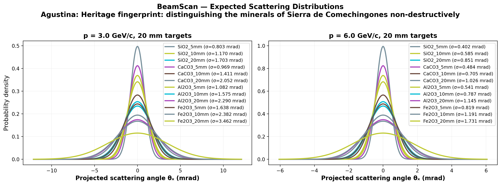

# 🔬 BeamScan Simulation Results

**Author:** Agustina  
**Description:** Heritage fingerprint: distinguishing the minerals of Sierra de Comechingones non-destructively  
**Generated:** 2026-03-01 03:27 UTC  
**Method:** Highland formula (analytical)

## Beam Settings
- Particle: `e-`
- Momenta: [3.0, 6.0] GeV/c
- Events requested: 10,000

## Predictions

| Material | p (GeV/c) | θ₀ (mrad) | ΔE (MeV) | X₀ (cm) | Thickness |
|----------|-----------|-----------|----------|---------|----------|
| SiO2_5mm | 3.0 | **0.803** | 2.2 | 12.29 | 5.0 mm |
| SiO2_5mm | 6.0 | **0.402** | 2.2 | 12.29 | 5.0 mm |
| SiO2_10mm | 3.0 | **1.170** | 4.4 | 12.29 | 10.0 mm |
| SiO2_10mm | 6.0 | **0.585** | 4.4 | 12.29 | 10.0 mm |
| SiO2_20mm | 3.0 | **1.703** | 8.8 | 12.29 | 20.0 mm |
| SiO2_20mm | 6.0 | **0.851** | 8.8 | 12.29 | 20.0 mm |
| CaCO3_5mm | 3.0 | **0.969** | 2.8 | 8.7 | 5.0 mm |
| CaCO3_5mm | 6.0 | **0.484** | 2.8 | 8.7 | 5.0 mm |
| CaCO3_10mm | 3.0 | **1.411** | 5.6 | 8.7 | 10.0 mm |
| CaCO3_10mm | 6.0 | **0.705** | 5.6 | 8.7 | 10.0 mm |
| CaCO3_20mm | 3.0 | **2.052** | 11.2 | 8.7 | 20.0 mm |
| CaCO3_20mm | 6.0 | **1.026** | 11.2 | 8.7 | 20.0 mm |
| Al2O3_5mm | 3.0 | **1.082** | 4.0 | 7.1 | 5.0 mm |
| Al2O3_5mm | 6.0 | **0.541** | 4.0 | 7.1 | 5.0 mm |
| Al2O3_10mm | 3.0 | **1.575** | 7.9 | 7.1 | 10.0 mm |
| Al2O3_10mm | 6.0 | **0.787** | 7.9 | 7.1 | 10.0 mm |
| Al2O3_20mm | 3.0 | **2.290** | 15.9 | 7.1 | 20.0 mm |
| Al2O3_20mm | 6.0 | **1.145** | 15.9 | 7.1 | 20.0 mm |
| Fe2O3_5mm | 3.0 | **1.638** | 5.2 | 3.3 | 5.0 mm |
| Fe2O3_5mm | 6.0 | **0.819** | 5.2 | 3.3 | 5.0 mm |
| Fe2O3_10mm | 3.0 | **2.382** | 10.5 | 3.3 | 10.0 mm |
| Fe2O3_10mm | 6.0 | **1.191** | 10.5 | 3.3 | 10.0 mm |
| Fe2O3_20mm | 3.0 | **3.462** | 21.0 | 3.3 | 20.0 mm |
| Fe2O3_20mm | 6.0 | **1.731** | 21.0 | 3.3 | 20.0 mm |

## Discrimination Power (at 3.0 GeV/c)

Events needed for 3σ separation:

| | SiO2_5mm | SiO2_10mm | SiO2_20mm | CaCO3_5mm | CaCO3_10mm | CaCO3_20mm | Al2O3_5mm | Al2O3_10mm | Al2O3_20mm | Fe2O3_5mm | Fe2O3_10mm | Fe2O3_20mm |
|---|---|---|---|---|---|---|---|---|---|---|---|---|
| **SiO2_5mm** | — | ✅ 131 | ✅ 35 | ✅ 515 | ✅ 60 | ✅ 24 | ✅ 206 | ✅ 43 | ✅ 20 | ✅ 39 | ✅ 19 | ✅ 12 |
| **SiO2_10mm** | ✅ 131 | — | ✅ 131 | ✅ 510 | ✅ 517 | ✅ 61 | ✅ 2,938 | ✅ 207 | ✅ 43 | ✅ 162 | ✅ 39 | ✅ 19 |
| **SiO2_20mm** | ✅ 35 | ✅ 131 | — | ✅ 60 | ✅ 512 | ✅ 520 | ✅ 91 | ✅ 2,951 | ✅ 208 | ⚠️ 12,062 | ✅ 163 | ✅ 39 |
| **CaCO3_5mm** | ✅ 515 | ✅ 510 | ✅ 60 | — | ✅ 131 | ✅ 35 | ✅ 1,485 | ✅ 80 | ✅ 28 | ✅ 69 | ✅ 26 | ✅ 15 |
| **CaCO3_10mm** | ✅ 60 | ✅ 517 | ✅ 512 | ✅ 131 | — | ✅ 132 | ✅ 259 | ✅ 1,491 | ✅ 80 | ✅ 809 | ✅ 69 | ✅ 26 |
| **CaCO3_20mm** | ✅ 24 | ✅ 61 | ✅ 520 | ✅ 35 | ✅ 132 | — | ✅ 47 | ✅ 260 | ✅ 1,498 | ✅ 358 | ✅ 812 | ✅ 69 |
| **Al2O3_5mm** | ✅ 206 | ✅ 2,938 | ✅ 91 | ✅ 1,485 | ✅ 259 | ✅ 47 | — | ✅ 131 | ✅ 36 | ✅ 108 | ✅ 32 | ✅ 17 |
| **Al2O3_10mm** | ✅ 43 | ✅ 207 | ✅ 2,951 | ✅ 80 | ✅ 1,491 | ✅ 260 | ✅ 131 | — | ✅ 132 | ⚠️ 11,536 | ✅ 109 | ✅ 33 |
| **Al2O3_20mm** | ✅ 20 | ✅ 43 | ✅ 208 | ✅ 28 | ✅ 80 | ✅ 1,498 | ✅ 36 | ✅ 132 | — | ✅ 164 | ⚠️ 11,585 | ✅ 109 |
| **Fe2O3_5mm** | ✅ 39 | ✅ 162 | ⚠️ 12,062 | ✅ 69 | ✅ 809 | ✅ 358 | ✅ 108 | ⚠️ 11,536 | ✅ 164 | — | ✅ 132 | ✅ 36 |
| **Fe2O3_10mm** | ✅ 19 | ✅ 39 | ✅ 163 | ✅ 26 | ✅ 69 | ✅ 812 | ✅ 32 | ✅ 109 | ⚠️ 11,585 | ✅ 132 | — | ✅ 132 |
| **Fe2O3_20mm** | ✅ 12 | ✅ 19 | ✅ 39 | ✅ 15 | ✅ 26 | ✅ 69 | ✅ 17 | ✅ 33 | ✅ 109 | ✅ 36 | ✅ 132 | — |

✅ Easy (<5k events) | ⚠️ Moderate (5k–100k) | ❌ Impractical (>100k)

## Figures

---
*Generated automatically by BeamScan Highland Calculator*
