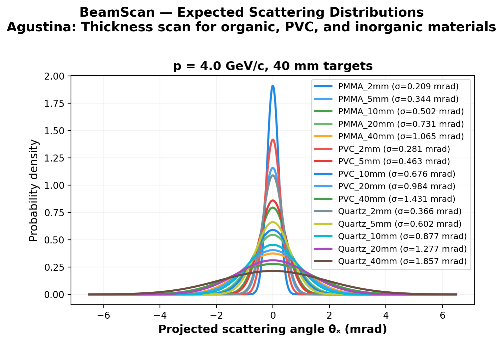

# 🔬 BeamScan Simulation Results

**Author:** Agustina  
**Description:** Thickness scan for organic, PVC, and inorganic materials  
**Generated:** 2026-03-01 00:27 UTC  
**Method:** Highland formula (analytical)

## Beam Settings
- Particle: `e-`
- Momenta: [4.0] GeV/c
- Events requested: 10,000

## Predictions

| Material | p (GeV/c) | θ₀ (mrad) | ΔE (MeV) | X₀ (cm) | Thickness |
|----------|-----------|-----------|----------|---------|----------|
| PMMA_2mm | 4.0 | **0.209** | 0.5 | 34.4 | 2.0 mm |
| PMMA_5mm | 4.0 | **0.344** | 1.2 | 34.4 | 5.0 mm |
| PMMA_10mm | 4.0 | **0.502** | 2.4 | 34.4 | 10.0 mm |
| PMMA_20mm | 4.0 | **0.731** | 4.7 | 34.4 | 20.0 mm |
| PMMA_40mm | 4.0 | **1.065** | 9.4 | 34.4 | 40.0 mm |
| PVC_2mm | 4.0 | **0.281** | 0.5 | 19.9 | 2.0 mm |
| PVC_5mm | 4.0 | **0.463** | 1.3 | 19.9 | 5.0 mm |
| PVC_10mm | 4.0 | **0.676** | 2.6 | 19.9 | 10.0 mm |
| PVC_20mm | 4.0 | **0.984** | 5.2 | 19.9 | 20.0 mm |
| PVC_40mm | 4.0 | **1.431** | 10.4 | 19.9 | 40.0 mm |
| Quartz_2mm | 4.0 | **0.366** | 0.9 | 12.29 | 2.0 mm |
| Quartz_5mm | 4.0 | **0.602** | 2.2 | 12.29 | 5.0 mm |
| Quartz_10mm | 4.0 | **0.877** | 4.4 | 12.29 | 10.0 mm |
| Quartz_20mm | 4.0 | **1.277** | 8.8 | 12.29 | 20.0 mm |
| Quartz_40mm | 4.0 | **1.857** | 17.6 | 12.29 | 40.0 mm |

## Discrimination Power (at 4.0 GeV/c)

Events needed for 3σ separation:

| | PMMA_2mm | PMMA_5mm | PMMA_10mm | PMMA_20mm | PMMA_40mm | PVC_2mm | PVC_5mm | PVC_10mm | PVC_20mm | PVC_40mm | Quartz_2mm | Quartz_5mm | Quartz_10mm | Quartz_20mm | Quartz_40mm |
|---|---|---|---|---|---|---|---|---|---|---|---|---|---|---|---|
| **PMMA_2mm** | — | ✅ 75 | ✅ 27 | ✅ 15 | ✅ 10 | ✅ 205 | ✅ 32 | ✅ 17 | ✅ 11 | ✅ 9 | ✅ 60 | ✅ 20 | ✅ 12 | ✅ 9 | ✅ 8 |
| **PMMA_5mm** | ✅ 75 | — | ✅ 130 | ✅ 35 | ✅ 18 | ✅ 448 | ✅ 206 | ✅ 43 | ✅ 20 | ✅ 12 | ✅ 4,748 | ✅ 61 | ✅ 24 | ✅ 14 | ✅ 10 |
| **PMMA_10mm** | ✅ 27 | ✅ 130 | — | ✅ 130 | ✅ 35 | ✅ 57 | ✅ 2,864 | ✅ 207 | ✅ 43 | ✅ 20 | ✅ 184 | ✅ 543 | ✅ 61 | ✅ 24 | ✅ 14 |
| **PMMA_20mm** | ✅ 15 | ✅ 35 | ✅ 130 | — | ✅ 131 | ✅ 23 | ✅ 90 | ✅ 2,878 | ✅ 208 | ✅ 43 | ✅ 41 | ✅ 483 | ✅ 545 | ✅ 61 | ✅ 24 |
| **PMMA_40mm** | ✅ 10 | ✅ 18 | ✅ 35 | ✅ 131 | — | ✅ 14 | ✅ 30 | ✅ 91 | ✅ 2,891 | ✅ 209 | ✅ 19 | ✅ 59 | ✅ 485 | ✅ 548 | ✅ 62 |
| **PVC_2mm** | ✅ 205 | ✅ 448 | ✅ 57 | ✅ 23 | ✅ 14 | — | ✅ 76 | ✅ 27 | ✅ 15 | ✅ 10 | ✅ 264 | ✅ 35 | ✅ 18 | ✅ 12 | ✅ 9 |
| **PVC_5mm** | ✅ 32 | ✅ 206 | ✅ 2,864 | ✅ 90 | ✅ 30 | ✅ 76 | — | ✅ 130 | ✅ 35 | ✅ 18 | ✅ 325 | ✅ 266 | ✅ 48 | ✅ 21 | ✅ 13 |
| **PVC_10mm** | ✅ 17 | ✅ 43 | ✅ 207 | ✅ 2,878 | ✅ 91 | ✅ 27 | ✅ 130 | — | ✅ 131 | ✅ 35 | ✅ 51 | ✅ 1,372 | ✅ 267 | ✅ 48 | ✅ 21 |
| **PVC_20mm** | ✅ 11 | ✅ 20 | ✅ 43 | ✅ 208 | ✅ 2,891 | ✅ 15 | ✅ 35 | ✅ 131 | — | ✅ 131 | ✅ 22 | ✅ 78 | ✅ 1,378 | ✅ 268 | ✅ 48 |
| **PVC_40mm** | ✅ 9 | ✅ 12 | ✅ 20 | ✅ 43 | ✅ 209 | ✅ 10 | ✅ 18 | ✅ 35 | ✅ 131 | — | ✅ 13 | ✅ 28 | ✅ 79 | ✅ 1,384 | ✅ 269 |
| **Quartz_2mm** | ✅ 60 | ✅ 4,748 | ✅ 184 | ✅ 41 | ✅ 19 | ✅ 264 | ✅ 325 | ✅ 51 | ✅ 22 | ✅ 13 | — | ✅ 76 | ✅ 27 | ✅ 15 | ✅ 11 |
| **Quartz_5mm** | ✅ 20 | ✅ 61 | ✅ 543 | ✅ 483 | ✅ 59 | ✅ 35 | ✅ 266 | ✅ 1,372 | ✅ 78 | ✅ 28 | ✅ 76 | — | ✅ 131 | ✅ 35 | ✅ 18 |
| **Quartz_10mm** | ✅ 12 | ✅ 24 | ✅ 61 | ✅ 545 | ✅ 485 | ✅ 18 | ✅ 48 | ✅ 267 | ✅ 1,378 | ✅ 79 | ✅ 27 | ✅ 131 | — | ✅ 131 | ✅ 36 |
| **Quartz_20mm** | ✅ 9 | ✅ 14 | ✅ 24 | ✅ 61 | ✅ 548 | ✅ 12 | ✅ 21 | ✅ 48 | ✅ 268 | ✅ 1,384 | ✅ 15 | ✅ 35 | ✅ 131 | — | ✅ 132 |
| **Quartz_40mm** | ✅ 8 | ✅ 10 | ✅ 14 | ✅ 24 | ✅ 62 | ✅ 9 | ✅ 13 | ✅ 21 | ✅ 48 | ✅ 269 | ✅ 11 | ✅ 18 | ✅ 36 | ✅ 132 | — |

✅ Easy (<5k events) | ⚠️ Moderate (5k–100k) | ❌ Impractical (>100k)

## Figures

---
*Generated automatically by BeamScan Highland Calculator*
