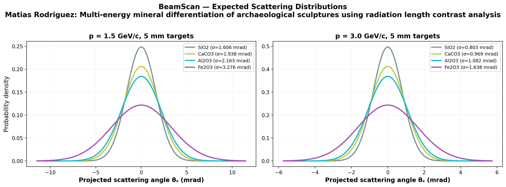
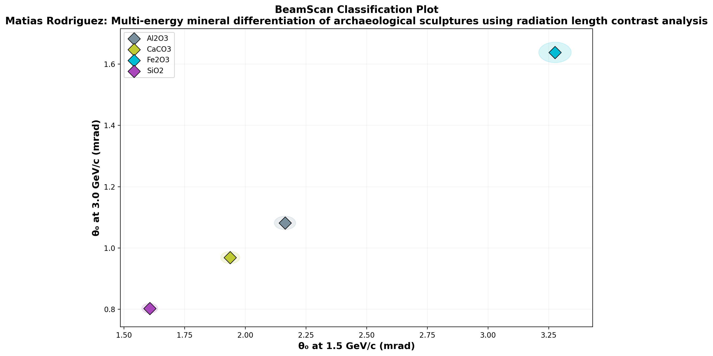

# 🔬 BeamScan Simulation Results

**Author:** María García  
**Description:** Multi-energy mineral differentiation of archaeological sculptures using radiation length contrast analysis  
**Generated:** 2026-03-01 00:02 UTC  
**Method:** Highland formula (analytical)

## Beam Settings
- Particle: `e-`
- Momenta: [1.5, 3.0] GeV/c
- Events requested: 30,000

## Predictions

| Material | p (GeV/c) | θ₀ (mrad) | ΔE (MeV) | X₀ (cm) | Thickness |
|----------|-----------|-----------|----------|---------|----------|
| SiO2 | 1.5 | **1.606** | 2.2 | 12.29 | 5.0 mm |
| SiO2 | 3.0 | **0.803** | 2.2 | 12.29 | 5.0 mm |
| CaCO3 | 1.5 | **1.938** | 2.8 | 8.7 | 5.0 mm |
| CaCO3 | 3.0 | **0.969** | 2.8 | 8.7 | 5.0 mm |
| Al2O3 | 1.5 | **2.163** | 4.0 | 7.1 | 5.0 mm |
| Al2O3 | 3.0 | **1.082** | 4.0 | 7.1 | 5.0 mm |
| Fe2O3 | 1.5 | **3.276** | 5.2 | 3.3 | 5.0 mm |
| Fe2O3 | 3.0 | **1.638** | 5.2 | 3.3 | 5.0 mm |

## Discrimination Power (at 1.5 GeV/c)

Events needed for 3σ separation:

| | SiO2 | CaCO3 | Al2O3 | Fe2O3 |
|---|---|---|---|---|
| **SiO2** | — | ✅ 515 | ✅ 206 | ✅ 39 |
| **CaCO3** | ✅ 515 | — | ✅ 1,485 | ✅ 69 |
| **Al2O3** | ✅ 206 | ✅ 1,485 | — | ✅ 108 |
| **Fe2O3** | ✅ 39 | ✅ 69 | ✅ 108 | — |

✅ Easy (<5k events) | ⚠️ Moderate (5k–100k) | ❌ Impractical (>100k)

## Figures

---
*Generated automatically by BeamScan Highland Calculator*
