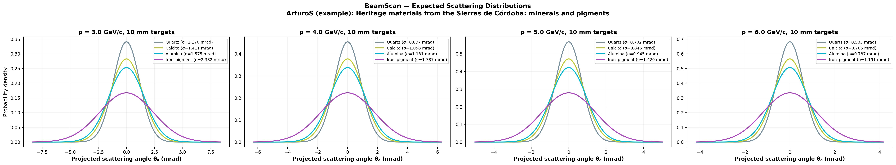
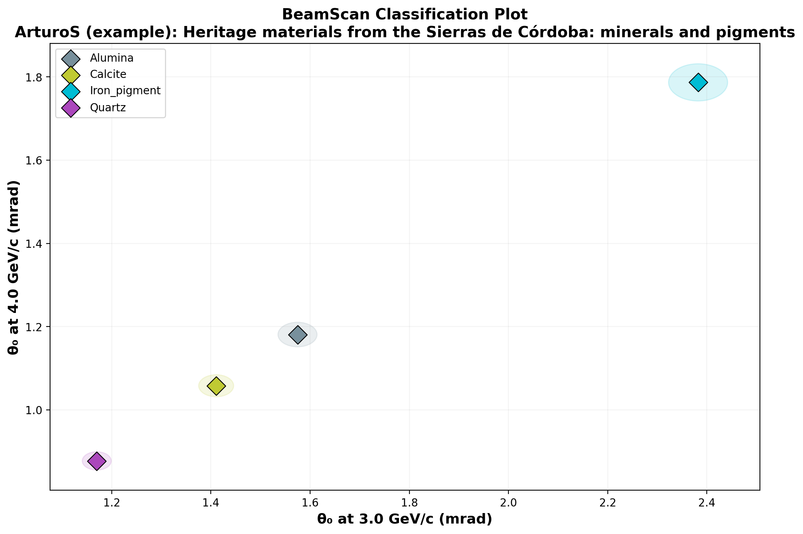

# 🔬 BeamScan Simulation Results

**Author:** ArturoS (example)  
**Description:** Heritage materials from the Sierras de Córdoba: minerals and pigments  
**Generated:** 2026-02-27 23:21 UTC  
**Method:** Highland formula (analytical)

## Beam Settings
- Particle: `e-`
- Momenta: [2.6, 2.8, 3.0, 3.2, 3.4, 3.6, 3.8, 4.0, 4.2, 4.4, 4.6, 4.8, 5.0] GeV/c
- Events requested: 20,000

## Predictions

| Material | p (GeV/c) | θ₀ (mrad) | ΔE (MeV) | X₀ (cm) | Thickness |
|----------|-----------|-----------|----------|---------|----------|
| Quartz | 2.6 | **1.350** | 4.4 | 12.29 | 10.0 mm |
| Quartz | 2.8 | **1.253** | 4.4 | 12.29 | 10.0 mm |
| Quartz | 3.0 | **1.170** | 4.4 | 12.29 | 10.0 mm |
| Quartz | 3.2 | **1.097** | 4.4 | 12.29 | 10.0 mm |
| Quartz | 3.4 | **1.032** | 4.4 | 12.29 | 10.0 mm |
| Quartz | 3.6 | **0.975** | 4.4 | 12.29 | 10.0 mm |
| Quartz | 3.8 | **0.924** | 4.4 | 12.29 | 10.0 mm |
| Quartz | 4.0 | **0.877** | 4.4 | 12.29 | 10.0 mm |
| Quartz | 4.2 | **0.836** | 4.4 | 12.29 | 10.0 mm |
| Quartz | 4.4 | **0.798** | 4.4 | 12.29 | 10.0 mm |
| Quartz | 4.6 | **0.763** | 4.4 | 12.29 | 10.0 mm |
| Quartz | 4.8 | **0.731** | 4.4 | 12.29 | 10.0 mm |
| Quartz | 5.0 | **0.702** | 4.4 | 12.29 | 10.0 mm |
| Calcite | 2.6 | **1.628** | 5.6 | 8.7 | 10.0 mm |
| Calcite | 2.8 | **1.511** | 5.6 | 8.7 | 10.0 mm |
| Calcite | 3.0 | **1.411** | 5.6 | 8.7 | 10.0 mm |
| Calcite | 3.2 | **1.322** | 5.6 | 8.7 | 10.0 mm |
| Calcite | 3.4 | **1.245** | 5.6 | 8.7 | 10.0 mm |
| Calcite | 3.6 | **1.175** | 5.6 | 8.7 | 10.0 mm |
| Calcite | 3.8 | **1.114** | 5.6 | 8.7 | 10.0 mm |
| Calcite | 4.0 | **1.058** | 5.6 | 8.7 | 10.0 mm |
| Calcite | 4.2 | **1.008** | 5.6 | 8.7 | 10.0 mm |
| Calcite | 4.4 | **0.962** | 5.6 | 8.7 | 10.0 mm |
| Calcite | 4.6 | **0.920** | 5.6 | 8.7 | 10.0 mm |
| Calcite | 4.8 | **0.882** | 5.6 | 8.7 | 10.0 mm |
| Calcite | 5.0 | **0.846** | 5.6 | 8.7 | 10.0 mm |
| Alumina | 2.6 | **1.817** | 7.9 | 7.1 | 10.0 mm |
| Alumina | 2.8 | **1.687** | 7.9 | 7.1 | 10.0 mm |
| Alumina | 3.0 | **1.575** | 7.9 | 7.1 | 10.0 mm |
| Alumina | 3.2 | **1.476** | 7.9 | 7.1 | 10.0 mm |
| Alumina | 3.4 | **1.389** | 7.9 | 7.1 | 10.0 mm |
| Alumina | 3.6 | **1.312** | 7.9 | 7.1 | 10.0 mm |
| Alumina | 3.8 | **1.243** | 7.9 | 7.1 | 10.0 mm |
| Alumina | 4.0 | **1.181** | 7.9 | 7.1 | 10.0 mm |
| Alumina | 4.2 | **1.125** | 7.9 | 7.1 | 10.0 mm |
| Alumina | 4.4 | **1.074** | 7.9 | 7.1 | 10.0 mm |
| Alumina | 4.6 | **1.027** | 7.9 | 7.1 | 10.0 mm |
| Alumina | 4.8 | **0.984** | 7.9 | 7.1 | 10.0 mm |
| Alumina | 5.0 | **0.945** | 7.9 | 7.1 | 10.0 mm |
| Iron_pigment | 2.6 | **2.749** | 10.5 | 3.3 | 10.0 mm |
| Iron_pigment | 2.8 | **2.552** | 10.5 | 3.3 | 10.0 mm |
| Iron_pigment | 3.0 | **2.382** | 10.5 | 3.3 | 10.0 mm |
| Iron_pigment | 3.2 | **2.233** | 10.5 | 3.3 | 10.0 mm |
| Iron_pigment | 3.4 | **2.102** | 10.5 | 3.3 | 10.0 mm |
| Iron_pigment | 3.6 | **1.985** | 10.5 | 3.3 | 10.0 mm |
| Iron_pigment | 3.8 | **1.881** | 10.5 | 3.3 | 10.0 mm |
| Iron_pigment | 4.0 | **1.787** | 10.5 | 3.3 | 10.0 mm |
| Iron_pigment | 4.2 | **1.702** | 10.5 | 3.3 | 10.0 mm |
| Iron_pigment | 4.4 | **1.624** | 10.5 | 3.3 | 10.0 mm |
| Iron_pigment | 4.6 | **1.554** | 10.5 | 3.3 | 10.0 mm |
| Iron_pigment | 4.8 | **1.489** | 10.5 | 3.3 | 10.0 mm |
| Iron_pigment | 5.0 | **1.429** | 10.5 | 3.3 | 10.0 mm |

## Discrimination Power (at 2.6 GeV/c)

Events needed for 3σ separation:

| | Quartz | Calcite | Alumina | Iron_pigment |
|---|---|---|---|---|
| **Quartz** | — | ✅ 517 | ✅ 207 | ✅ 39 |
| **Calcite** | ✅ 517 | — | ✅ 1,491 | ✅ 69 |
| **Alumina** | ✅ 207 | ✅ 1,491 | — | ✅ 109 |
| **Iron_pigment** | ✅ 39 | ✅ 69 | ✅ 109 | — |

✅ Easy (<5k events) | ⚠️ Moderate (5k–100k) | ❌ Impractical (>100k)

## Figures

---
*Generated automatically by BeamScan Highland Calculator*
