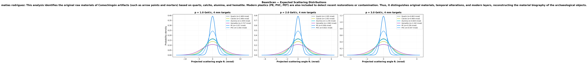
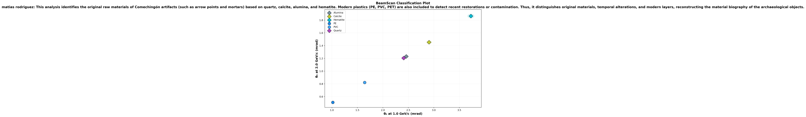

# 🔬 BeamScan Simulation Results

**Author:** matias rodriguez  
**Description:** This analysis identifies the original raw materials of Comechingón artifacts (such as arrow points and mortars) based on quartz, calcite, alumina, and hematite. Modern plastics (PE, PVC, PET) are also included to detect recent restorations or contamination. Thus, it distinguishes original materials, temporal alterations, and modern layers, reconstructing the material biography of the archaeological objects.  
**Generated:** 2026-03-01 04:16 UTC  
**Method:** Highland formula (analytical)

## Beam Settings
- Particle: `e-`
- Momenta: [1.0, 2.0, 3.0] GeV/c
- Events requested: 40,000

## Predictions

| Material | p (GeV/c) | θ₀ (mrad) | ΔE (MeV) | X₀ (cm) | Thickness |
|----------|-----------|-----------|----------|---------|----------|
| Quartz | 1.0 | **2.409** | 2.2 | 12.29 | 5.0 mm |
| Quartz | 2.0 | **1.205** | 2.2 | 12.29 | 5.0 mm |
| Quartz | 3.0 | **0.803** | 2.2 | 12.29 | 5.0 mm |
| Calcite | 1.0 | **2.906** | 2.8 | 8.7 | 5.0 mm |
| Calcite | 2.0 | **1.453** | 2.8 | 8.7 | 5.0 mm |
| Calcite | 3.0 | **0.969** | 2.8 | 8.7 | 5.0 mm |
| Alumina | 1.0 | **2.459** | 2.4 | 7.1 | 3.0 mm |
| Alumina | 2.0 | **1.230** | 2.4 | 7.1 | 3.0 mm |
| Alumina | 3.0 | **0.820** | 2.4 | 7.1 | 3.0 mm |
| Hematite | 1.0 | **3.727** | 3.1 | 3.3 | 3.0 mm |
| Hematite | 2.0 | **1.863** | 3.1 | 3.3 | 3.0 mm |
| Hematite | 3.0 | **1.242** | 3.1 | 3.3 | 3.0 mm |
| PE | 1.0 | **1.017** | 0.8 | 47.9 | 4.0 mm |
| PE | 2.0 | **0.508** | 0.8 | 47.9 | 4.0 mm |
| PE | 3.0 | **0.339** | 0.8 | 47.9 | 4.0 mm |
| PVC | 1.0 | **1.642** | 1.0 | 19.9 | 4.0 mm |
| PVC | 2.0 | **0.821** | 1.0 | 19.9 | 4.0 mm |
| PVC | 3.0 | **0.547** | 1.0 | 19.9 | 4.0 mm |

## Discrimination Power (at 1.0 GeV/c)

Events needed for 3σ separation:

| | Quartz | Calcite | Alumina | Hematite | PE | PVC |
|---|---|---|---|---|---|---|
| **Quartz** | — | ✅ 515 | ⚠️ 42,546 | ✅ 98 | ✅ 28 | ✅ 126 |
| **Calcite** | ✅ 515 | — | ✅ 649 | ✅ 295 | ✅ 20 | ✅ 59 |
| **Alumina** | ⚠️ 42,546 | ✅ 649 | — | ✅ 108 | ✅ 27 | ✅ 114 |
| **Hematite** | ✅ 98 | ✅ 295 | ✅ 108 | — | ✅ 14 | ✅ 30 |
| **PE** | ✅ 28 | ✅ 20 | ✅ 27 | ✅ 14 | — | ✅ 82 |
| **PVC** | ✅ 126 | ✅ 59 | ✅ 114 | ✅ 30 | ✅ 82 | — |

✅ Easy (<5k events) | ⚠️ Moderate (5k–100k) | ❌ Impractical (>100k)

## Figures

---
*Generated automatically by BeamScan Highland Calculator*
