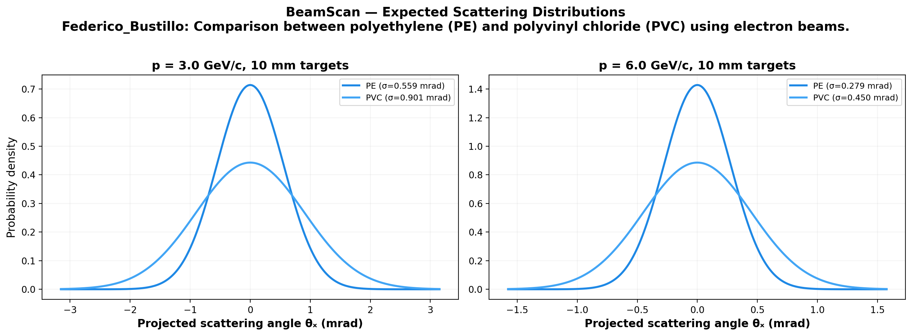
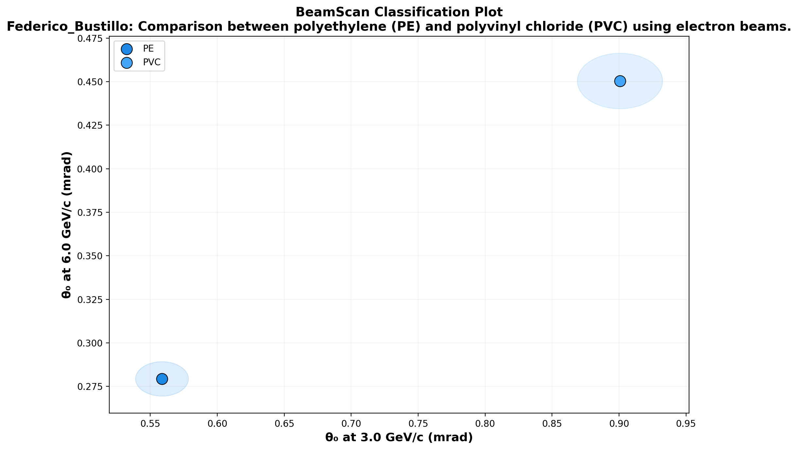

# 🔬 BeamScan Simulation Results

**Author:** Federico_Bustillo  
**Description:** Comparison between polyethylene (PE) and polyvinyl chloride (PVC) using electron beams.  
**Generated:** 2026-03-02 14:55 UTC  
**Method:** Highland formula (analytical)

## Beam Settings
- Particle: `e-`
- Momenta: [3.0, 6.0] GeV/c
- Events requested: 10,000

## Predictions

| Material | p (GeV/c) | θ₀ (mrad) | ΔE (MeV) | X₀ (cm) | Thickness |
|----------|-----------|-----------|----------|---------|----------|
| PE | 3.0 | **0.559** | 1.9 | 47.9 | 10.0 mm |
| PE | 6.0 | **0.279** | 1.9 | 47.9 | 10.0 mm |
| PVC | 3.0 | **0.901** | 2.6 | 19.9 | 10.0 mm |
| PVC | 6.0 | **0.450** | 2.6 | 19.9 | 10.0 mm |

## Discrimination Power (at 3.0 GeV/c)

Events needed for 3σ separation:

| | PE | PVC |
|---|---|---|
| **PE** | — | ✅ 82 |
| **PVC** | ✅ 82 | — |

✅ Easy (<5k events) | ⚠️ Moderate (5k–100k) | ❌ Impractical (>100k)

## Figures

---
*Generated automatically by BeamScan Highland Calculator*
