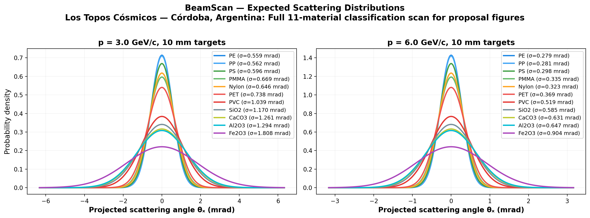
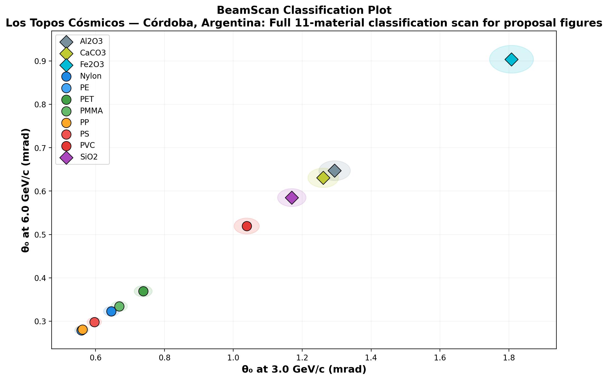

# 🔬 BeamScan Simulation Results

**Author:** Los Topos Cósmicos — Córdoba, Argentina  
**Description:** Full 11-material classification scan for proposal figures  
**Generated:** 2026-02-22 00:56 UTC  
**Method:** Highland formula (analytical)

## Beam Settings
- Particle: `e-`
- Momenta: [3.0, 6.0] GeV/c
- Events requested: 10,000

## Predictions

| Material | p (GeV/c) | θ₀ (mrad) | ΔE (MeV) | X₀ (cm) | Thickness |
|----------|-----------|-----------|----------|---------|----------|
| PE | 3.0 | **0.559** | 1.9 | 47.9 | 10.0 mm |
| PE | 6.0 | **0.279** | 1.9 | 47.9 | 10.0 mm |
| PP | 3.0 | **0.562** | 1.8 | 47.4 | 10.0 mm |
| PP | 6.0 | **0.281** | 1.8 | 47.4 | 10.0 mm |
| PS | 3.0 | **0.596** | 2.1 | 42.5 | 10.0 mm |
| PS | 6.0 | **0.298** | 2.1 | 42.5 | 10.0 mm |
| PMMA | 3.0 | **0.669** | 2.4 | 34.4 | 10.0 mm |
| PMMA | 6.0 | **0.335** | 2.4 | 34.4 | 10.0 mm |
| Nylon | 3.0 | **0.646** | 2.3 | 36.7 | 10.0 mm |
| Nylon | 6.0 | **0.323** | 2.3 | 36.7 | 10.0 mm |
| PET | 3.0 | **0.738** | 2.8 | 28.7 | 10.0 mm |
| PET | 6.0 | **0.369** | 2.8 | 28.7 | 10.0 mm |
| PVC | 3.0 | **1.039** | 2.8 | 15.3 | 10.0 mm |
| PVC | 6.0 | **0.519** | 2.8 | 15.3 | 10.0 mm |
| SiO2 | 3.0 | **1.170** | 4.4 | 12.29 | 10.0 mm |
| SiO2 | 6.0 | **0.585** | 4.4 | 12.29 | 10.0 mm |
| CaCO3 | 3.0 | **1.261** | 5.4 | 10.7 | 10.0 mm |
| CaCO3 | 6.0 | **0.631** | 5.4 | 10.7 | 10.0 mm |
| Al2O3 | 3.0 | **1.294** | 7.9 | 10.2 | 10.0 mm |
| Al2O3 | 6.0 | **0.647** | 7.9 | 10.2 | 10.0 mm |
| Fe2O3 | 3.0 | **1.808** | 10.5 | 5.5 | 10.0 mm |
| Fe2O3 | 6.0 | **0.904** | 10.5 | 5.5 | 10.0 mm |

## Discrimination Power (at 3.0 GeV/c)

Events needed for 3σ separation:

| | PE | PP | PS | PMMA | Nylon | PET | PVC | SiO2 | CaCO3 | Al2O3 | Fe2O3 |
|---|---|---|---|---|---|---|---|---|---|---|---|
| **PE** | — | ❌ 551,308 | ✅ 4,248 | ✅ 558 | ✅ 860 | ✅ 235 | ✅ 50 | ✅ 36 | ✅ 31 | ✅ 29 | ✅ 17 |
| **PP** | ❌ 551,308 | — | ⚠️ 5,104 | ✅ 595 | ✅ 932 | ✅ 245 | ✅ 51 | ✅ 37 | ✅ 31 | ✅ 29 | ✅ 17 |
| **PS** | ✅ 4,248 | ⚠️ 5,104 | — | ✅ 1,363 | ✅ 2,827 | ✅ 398 | ✅ 62 | ✅ 43 | ✅ 36 | ✅ 34 | ✅ 18 |
| **PMMA** | ✅ 558 | ✅ 595 | ✅ 1,363 | — | ⚠️ 14,526 | ✅ 1,859 | ✅ 96 | ✅ 61 | ✅ 48 | ✅ 45 | ✅ 22 |
| **Nylon** | ✅ 860 | ✅ 932 | ✅ 2,827 | ⚠️ 14,526 | — | ✅ 1,010 | ✅ 83 | ✅ 55 | ✅ 44 | ✅ 41 | ✅ 21 |
| **PET** | ✅ 235 | ✅ 245 | ✅ 398 | ✅ 1,859 | ✅ 1,010 | — | ✅ 158 | ✅ 88 | ✅ 66 | ✅ 61 | ✅ 26 |
| **PVC** | ✅ 50 | ✅ 51 | ✅ 62 | ✅ 96 | ✅ 83 | ✅ 158 | — | ✅ 1,279 | ✅ 483 | ✅ 376 | ✅ 62 |
| **SiO2** | ✅ 36 | ✅ 37 | ✅ 43 | ✅ 61 | ✅ 55 | ✅ 88 | ✅ 1,279 | — | ✅ 3,197 | ✅ 1,768 | ✅ 99 |
| **CaCO3** | ✅ 31 | ✅ 31 | ✅ 36 | ✅ 48 | ✅ 44 | ✅ 66 | ✅ 483 | ✅ 3,197 | — | ⚠️ 26,786 | ✅ 142 |
| **Al2O3** | ✅ 29 | ✅ 29 | ✅ 34 | ✅ 45 | ✅ 41 | ✅ 61 | ✅ 376 | ✅ 1,768 | ⚠️ 26,786 | — | ✅ 165 |
| **Fe2O3** | ✅ 17 | ✅ 17 | ✅ 18 | ✅ 22 | ✅ 21 | ✅ 26 | ✅ 62 | ✅ 99 | ✅ 142 | ✅ 165 | — |

✅ Easy (<5k events) | ⚠️ Moderate (5k–100k) | ❌ Impractical (>100k)

## Figures

---
*Generated automatically by BeamScan Highland Calculator*
