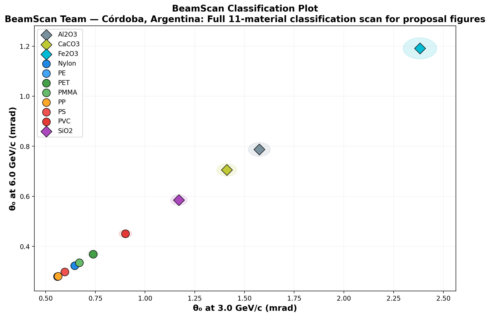

# 🔬 BeamScan Simulation Results

**Author:** BeamScan Team — Córdoba, Argentina  
**Description:** Full 11-material classification scan for proposal figures  
**Generated:** 2026-02-22 03:01 UTC  
**Method:** Highland formula (analytical)

## Beam Settings
- Particle: `e-`
- Momenta: [3.0, 6.0] GeV/c
- Events requested: 10,000

## Predictions

| Material | p (GeV/c) | θ₀ (mrad) | ΔE (MeV) | X₀ (cm) | Thickness |
|----------|-----------|-----------|----------|---------|----------|
| PE | 3.0 | **0.559** | 1.9 | 47.9 | 10.0 mm |
| PE | 6.0 | **0.279** | 1.9 | 47.9 | 10.0 mm |
| PP | 3.0 | **0.562** | 1.8 | 47.4 | 10.0 mm |
| PP | 6.0 | **0.281** | 1.8 | 47.4 | 10.0 mm |
| PS | 3.0 | **0.596** | 2.1 | 42.5 | 10.0 mm |
| PS | 6.0 | **0.298** | 2.1 | 42.5 | 10.0 mm |
| PMMA | 3.0 | **0.669** | 2.4 | 34.4 | 10.0 mm |
| PMMA | 6.0 | **0.335** | 2.4 | 34.4 | 10.0 mm |
| Nylon | 3.0 | **0.646** | 2.3 | 36.7 | 10.0 mm |
| Nylon | 6.0 | **0.323** | 2.3 | 36.7 | 10.0 mm |
| PET | 3.0 | **0.738** | 2.8 | 28.7 | 10.0 mm |
| PET | 6.0 | **0.369** | 2.8 | 28.7 | 10.0 mm |
| PVC | 3.0 | **0.901** | 2.6 | 19.9 | 10.0 mm |
| PVC | 6.0 | **0.450** | 2.6 | 19.9 | 10.0 mm |
| SiO2 | 3.0 | **1.170** | 4.4 | 12.29 | 10.0 mm |
| SiO2 | 6.0 | **0.585** | 4.4 | 12.29 | 10.0 mm |
| CaCO3 | 3.0 | **1.411** | 5.6 | 8.7 | 10.0 mm |
| CaCO3 | 6.0 | **0.705** | 5.6 | 8.7 | 10.0 mm |
| Al2O3 | 3.0 | **1.575** | 7.9 | 7.1 | 10.0 mm |
| Al2O3 | 6.0 | **0.787** | 7.9 | 7.1 | 10.0 mm |
| Fe2O3 | 3.0 | **2.382** | 10.5 | 3.3 | 10.0 mm |
| Fe2O3 | 6.0 | **1.191** | 10.5 | 3.3 | 10.0 mm |

## Discrimination Power (at 3.0 GeV/c)

Events needed for 3σ separation:

| | PE | PP | PS | PMMA | Nylon | PET | PVC | SiO2 | CaCO3 | Al2O3 | Fe2O3 |
|---|---|---|---|---|---|---|---|---|---|---|---|
| **PE** | — | ❌ 551,308 | ✅ 4,248 | ✅ 558 | ✅ 860 | ✅ 235 | ✅ 82 | ✅ 36 | ✅ 25 | ✅ 20 | ✅ 12 |
| **PP** | ❌ 551,308 | — | ⚠️ 5,104 | ✅ 595 | ✅ 932 | ✅ 245 | ✅ 84 | ✅ 37 | ✅ 25 | ✅ 21 | ✅ 12 |
| **PS** | ✅ 4,248 | ⚠️ 5,104 | — | ✅ 1,363 | ✅ 2,827 | ✅ 398 | ✅ 109 | ✅ 43 | ✅ 28 | ✅ 23 | ✅ 13 |
| **PMMA** | ✅ 558 | ✅ 595 | ✅ 1,363 | — | ⚠️ 14,526 | ✅ 1,859 | ✅ 207 | ✅ 61 | ✅ 36 | ✅ 28 | ✅ 15 |
| **Nylon** | ✅ 860 | ✅ 932 | ✅ 2,827 | ⚠️ 14,526 | — | ✅ 1,010 | ✅ 166 | ✅ 55 | ✅ 33 | ✅ 26 | ✅ 14 |
| **PET** | ✅ 235 | ✅ 245 | ✅ 398 | ✅ 1,859 | ✅ 1,010 | — | ✅ 458 | ✅ 88 | ✅ 46 | ✅ 35 | ✅ 17 |
| **PVC** | ✅ 82 | ✅ 84 | ✅ 109 | ✅ 207 | ✅ 166 | ✅ 458 | — | ✅ 267 | ✅ 93 | ✅ 61 | ✅ 23 |
| **SiO2** | ✅ 36 | ✅ 37 | ✅ 43 | ✅ 61 | ✅ 55 | ✅ 88 | ✅ 267 | — | ✅ 517 | ✅ 207 | ✅ 39 |
| **CaCO3** | ✅ 25 | ✅ 25 | ✅ 28 | ✅ 36 | ✅ 33 | ✅ 46 | ✅ 93 | ✅ 517 | — | ✅ 1,491 | ✅ 69 |
| **Al2O3** | ✅ 20 | ✅ 21 | ✅ 23 | ✅ 28 | ✅ 26 | ✅ 35 | ✅ 61 | ✅ 207 | ✅ 1,491 | — | ✅ 109 |
| **Fe2O3** | ✅ 12 | ✅ 12 | ✅ 13 | ✅ 15 | ✅ 14 | ✅ 17 | ✅ 23 | ✅ 39 | ✅ 69 | ✅ 109 | — |

✅ Easy (<5k events) | ⚠️ Moderate (5k–100k) | ❌ Impractical (>100k)

## Figures

---
*Generated automatically by BeamScan Highland Calculator*
