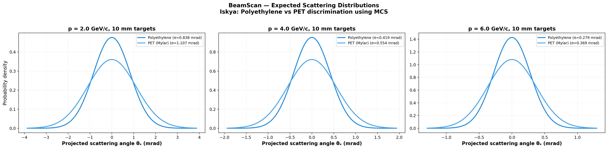
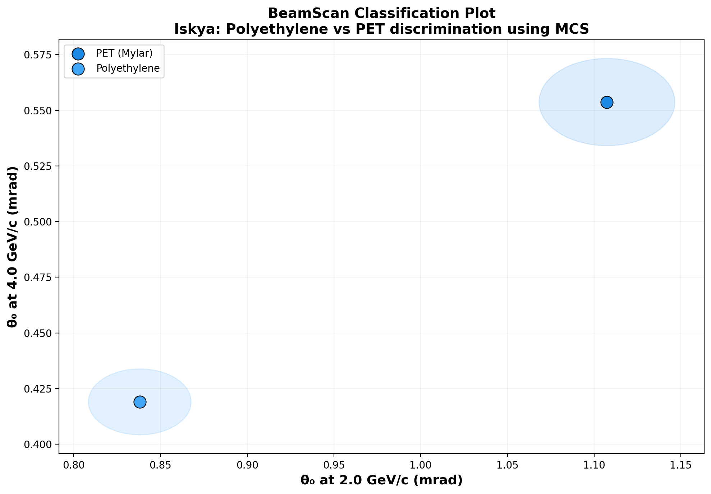

# 🔬 BeamScan Simulation Results

**Author:** Iskya  
**Description:** Polyethylene vs PET discrimination using MCS  
**Generated:** 2026-03-01 00:01 UTC  
**Method:** Highland formula (analytical)

## Beam Settings
- Particle: `e-`
- Momenta: [2.0, 4.0, 6.0] GeV/c
- Events requested: 10,000

## Predictions

| Material | p (GeV/c) | θ₀ (mrad) | ΔE (MeV) | X₀ (cm) | Thickness |
|----------|-----------|-----------|----------|---------|----------|
| Polyethylene | 2.0 | **0.838** | 1.9 | 47.9 | 10.0 mm |
| Polyethylene | 4.0 | **0.419** | 1.9 | 47.9 | 10.0 mm |
| Polyethylene | 6.0 | **0.279** | 1.9 | 47.9 | 10.0 mm |
| PET (Mylar) | 2.0 | **1.107** | 2.8 | 28.7 | 10.0 mm |
| PET (Mylar) | 4.0 | **0.554** | 2.8 | 28.7 | 10.0 mm |
| PET (Mylar) | 6.0 | **0.369** | 2.8 | 28.7 | 10.0 mm |

## Discrimination Power (at 2.0 GeV/c)

Events needed for 3σ separation:

| | Polyethylene | PET (Mylar) |
|---|---|---|
| **Polyethylene** | — | ✅ 235 |
| **PET (Mylar)** | ✅ 235 | — |

✅ Easy (<5k events) | ⚠️ Moderate (5k–100k) | ❌ Impractical (>100k)

## Figures

---
*Generated automatically by BeamScan Highland Calculator*
