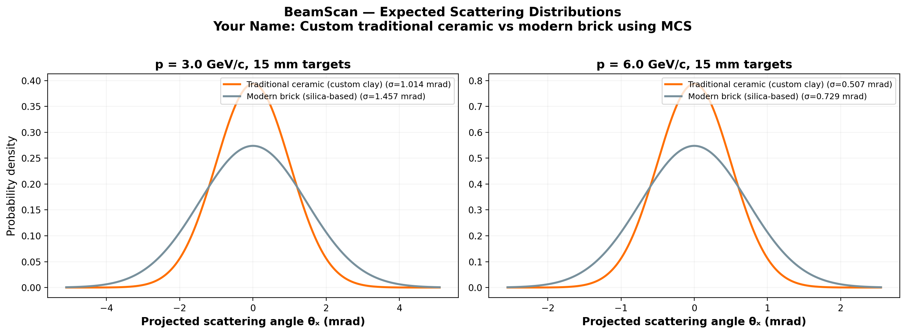
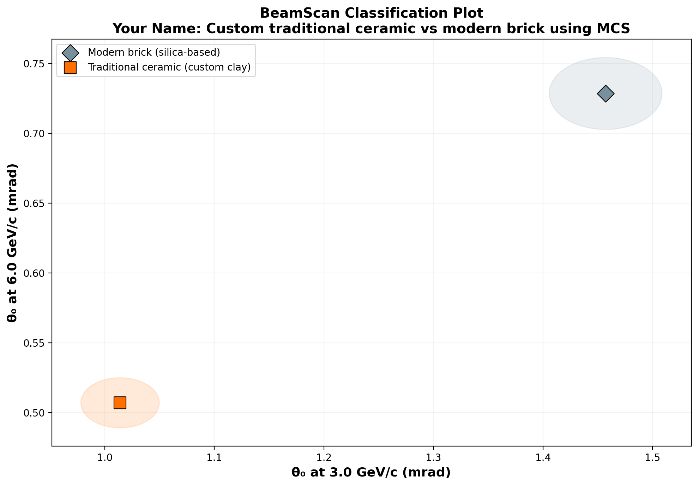

# 🔬 BeamScan Simulation Results

**Author:** Your Name  
**Description:** Custom traditional ceramic vs modern brick using MCS  
**Generated:** 2026-03-02 15:30 UTC  
**Method:** Highland formula (analytical)

## Beam Settings
- Particle: `e-`
- Momenta: [3.0, 6.0] GeV/c
- Events requested: 10,000

## Predictions

| Material | p (GeV/c) | θ₀ (mrad) | ΔE (MeV) | X₀ (cm) | Thickness |
|----------|-----------|-----------|----------|---------|----------|
| Traditional ceramic (custom clay) | 3.0 | **1.014** | 5.8 | 24.0 | 15.0 mm |
| Traditional ceramic (custom clay) | 6.0 | **0.507** | 5.8 | 24.0 | 15.0 mm |
| Modern brick (silica-based) | 3.0 | **1.457** | 6.6 | 12.29 | 15.0 mm |
| Modern brick (silica-based) | 6.0 | **0.729** | 6.6 | 12.29 | 15.0 mm |

## Discrimination Power (at 3.0 GeV/c)

Events needed for 3σ separation:

| | Traditional ceramic (custom clay) | Modern brick (silica-based) |
|---|---|---|
| **Traditional ceramic (custom clay)** | — | ✅ 140 |
| **Modern brick (silica-based)** | ✅ 140 | — |

✅ Easy (<5k events) | ⚠️ Moderate (5k–100k) | ❌ Impractical (>100k)

## Figures

---
*Generated automatically by BeamScan Highland Calculator*
