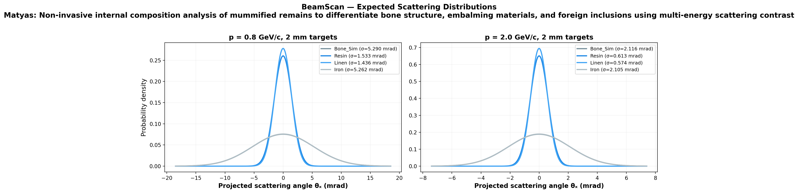
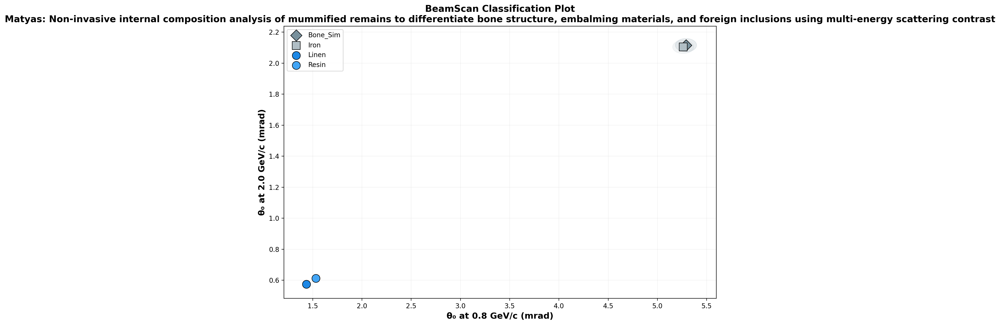

# 🔬 BeamScan Simulation Results

**Author:** Matyas  
**Description:** Non-invasive internal composition analysis of mummified remains to differentiate bone structure, embalming materials, and foreign inclusions using multi-energy scattering contrast  
**Generated:** 2026-02-27 18:45 UTC  
**Method:** Highland formula (analytical)

## Beam Settings
- Particle: `e-`
- Momenta: [0.8, 2.0] GeV/c
- Events requested: 30,000

## Predictions

| Material | p (GeV/c) | θ₀ (mrad) | ΔE (MeV) | X₀ (cm) | Thickness |
|----------|-----------|-----------|----------|---------|----------|
| Bone_Sim | 0.8 | **5.290** | 5.6 | 8.7 | 10.0 mm |
| Bone_Sim | 2.0 | **2.116** | 5.6 | 8.7 | 10.0 mm |
| Resin | 0.8 | **1.533** | 1.1 | 42.5 | 5.0 mm |
| Resin | 2.0 | **0.613** | 1.1 | 42.5 | 5.0 mm |
| Linen | 0.8 | **1.436** | 0.9 | 47.9 | 5.0 mm |
| Linen | 2.0 | **0.574** | 0.9 | 47.9 | 5.0 mm |
| Iron | 0.8 | **5.262** | 3.1 | 1.757 | 2.0 mm |
| Iron | 2.0 | **2.105** | 3.1 | 1.757 | 2.0 mm |

## Discrimination Power (at 0.8 GeV/c)

Events needed for 3σ separation:

| | Bone_Sim | Resin | Linen | Iron |
|---|---|---|---|---|
| **Bone_Sim** | — | ✅ 15 | ✅ 14 | ❌ 649,600 |
| **Resin** | ✅ 15 | — | ✅ 4,226 | ✅ 15 |
| **Linen** | ✅ 14 | ✅ 4,226 | — | ✅ 14 |
| **Iron** | ❌ 649,600 | ✅ 15 | ✅ 14 | — |

✅ Easy (<5k events) | ⚠️ Moderate (5k–100k) | ❌ Impractical (>100k)

## Figures

---
*Generated automatically by BeamScan Highland Calculator*
