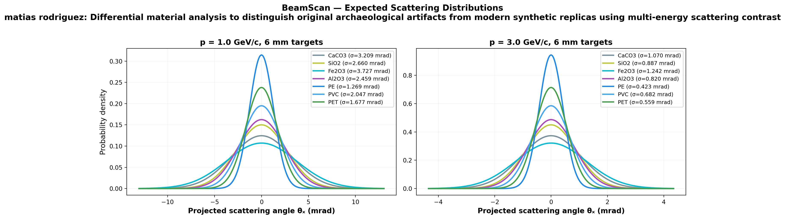
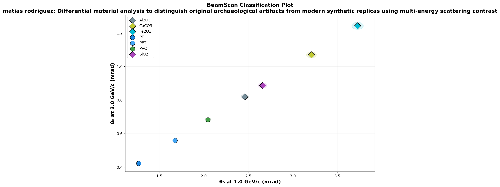

# 🔬 BeamScan Simulation Results

**Author:** matias rodriguez  
**Description:** Differential material analysis to distinguish original archaeological artifacts from modern synthetic replicas using multi-energy scattering contrast  
**Generated:** 2026-03-01 00:21 UTC  
**Method:** Highland formula (analytical)

## Beam Settings
- Particle: `e-`
- Momenta: [1.0, 3.0] GeV/c
- Events requested: 40,000

## Predictions

| Material | p (GeV/c) | θ₀ (mrad) | ΔE (MeV) | X₀ (cm) | Thickness |
|----------|-----------|-----------|----------|---------|----------|
| CaCO3 | 1.0 | **3.209** | 3.4 | 8.7 | 6.0 mm |
| CaCO3 | 3.0 | **1.070** | 3.4 | 8.7 | 6.0 mm |
| SiO2 | 1.0 | **2.660** | 2.6 | 12.29 | 6.0 mm |
| SiO2 | 3.0 | **0.887** | 2.6 | 12.29 | 6.0 mm |
| Fe2O3 | 1.0 | **3.727** | 3.1 | 3.3 | 3.0 mm |
| Fe2O3 | 3.0 | **1.242** | 3.1 | 3.3 | 3.0 mm |
| Al2O3 | 1.0 | **2.459** | 2.4 | 7.1 | 3.0 mm |
| Al2O3 | 3.0 | **0.820** | 2.4 | 7.1 | 3.0 mm |
| PE | 1.0 | **1.269** | 1.1 | 47.9 | 6.0 mm |
| PE | 3.0 | **0.423** | 1.1 | 47.9 | 6.0 mm |
| PVC | 1.0 | **2.047** | 1.6 | 19.9 | 6.0 mm |
| PVC | 3.0 | **0.682** | 1.6 | 19.9 | 6.0 mm |
| PET | 1.0 | **1.677** | 1.7 | 28.7 | 6.0 mm |
| PET | 3.0 | **0.559** | 1.7 | 28.7 | 6.0 mm |

## Discrimination Power (at 1.0 GeV/c)

Events needed for 3σ separation:

| | CaCO3 | SiO2 | Fe2O3 | Al2O3 | PE | PVC | PET |
|---|---|---|---|---|---|---|---|
| **CaCO3** | — | ✅ 516 | ✅ 806 | ✅ 258 | ✅ 24 | ✅ 93 | ✅ 46 |
| **SiO2** | ✅ 516 | — | ✅ 162 | ✅ 2,928 | ✅ 36 | ✅ 266 | ✅ 88 |
| **Fe2O3** | ✅ 806 | ✅ 162 | — | ✅ 108 | ✅ 19 | ✅ 54 | ✅ 32 |
| **Al2O3** | ✅ 258 | ✅ 2,928 | ✅ 108 | — | ✅ 45 | ✅ 539 | ✅ 126 |
| **PE** | ✅ 24 | ✅ 36 | ✅ 19 | ✅ 45 | — | ✅ 82 | ✅ 234 |
| **PVC** | ✅ 93 | ✅ 266 | ✅ 54 | ✅ 539 | ✅ 82 | — | ✅ 457 |
| **PET** | ✅ 46 | ✅ 88 | ✅ 32 | ✅ 126 | ✅ 234 | ✅ 457 | — |

✅ Easy (<5k events) | ⚠️ Moderate (5k–100k) | ❌ Impractical (>100k)

## Figures

---
*Generated automatically by BeamScan Highland Calculator*
