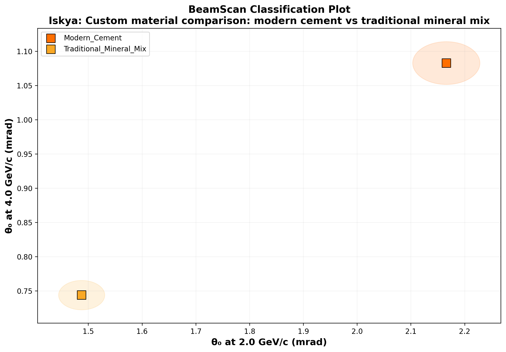

# 🔬 BeamScan Simulation Results

**Author:** Iskya  
**Description:** Custom material comparison: modern cement vs traditional mineral mix  
**Generated:** 2026-02-28 00:58 UTC  
**Method:** Highland formula (analytical)

## Beam Settings
- Particle: `e-`
- Momenta: [2.0, 4.0, 6.0] GeV/c
- Events requested: 15,000

## Predictions

| Material | p (GeV/c) | θ₀ (mrad) | ΔE (MeV) | X₀ (cm) | Thickness |
|----------|-----------|-----------|----------|---------|----------|
| Traditional_Mineral_Mix | 2.0 | **1.488** | 6.9 | 25.0 | 15 mm |
| Traditional_Mineral_Mix | 4.0 | **0.744** | 6.9 | 25.0 | 15 mm |
| Traditional_Mineral_Mix | 6.0 | **0.496** | 6.9 | 25.0 | 15 mm |
| Modern_Cement | 2.0 | **2.166** | 8.4 | 12.5 | 15 mm |
| Modern_Cement | 4.0 | **1.083** | 8.4 | 12.5 | 15 mm |
| Modern_Cement | 6.0 | **0.722** | 8.4 | 12.5 | 15 mm |

## Discrimination Power (at 2.0 GeV/c)

Events needed for 3σ separation:

| | Traditional_Mineral_Mix | Modern_Cement |
|---|---|---|
| **Traditional_Mineral_Mix** | — | ✅ 131 |
| **Modern_Cement** | ✅ 131 | — |

✅ Easy (<5k events) | ⚠️ Moderate (5k–100k) | ❌ Impractical (>100k)

## Figures

---
*Generated automatically by BeamScan Highland Calculator*
