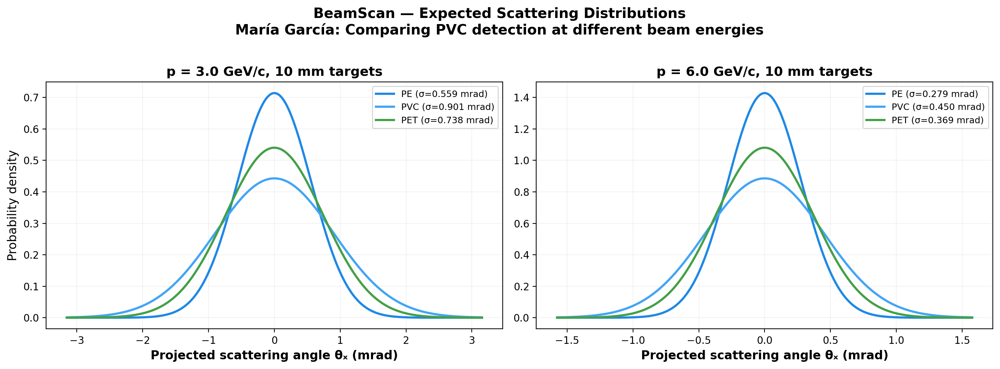
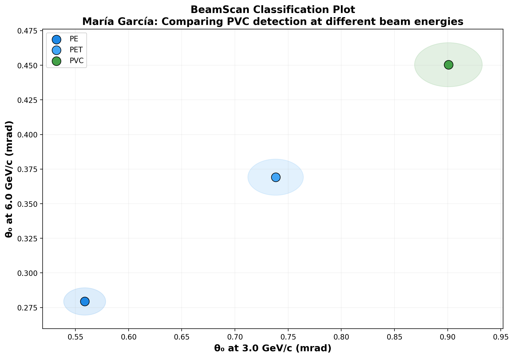

# 🔬 BeamScan Simulation Results

**Author:** María García  
**Description:** Comparing PVC detection at different beam energies  
**Generated:** 2026-02-27 22:57 UTC  
**Method:** Highland formula (analytical)

## Beam Settings
- Particle: `e-`
- Momenta: [3.0, 6.0] GeV/c
- Events requested: 10,000

## Predictions

| Material | p (GeV/c) | θ₀ (mrad) | ΔE (MeV) | X₀ (cm) | Thickness |
|----------|-----------|-----------|----------|---------|----------|
| PE | 3.0 | **0.559** | 1.9 | 47.9 | 10.0 mm |
| PE | 6.0 | **0.279** | 1.9 | 47.9 | 10.0 mm |
| PVC | 3.0 | **0.901** | 2.6 | 19.9 | 10.0 mm |
| PVC | 6.0 | **0.450** | 2.6 | 19.9 | 10.0 mm |
| PET | 3.0 | **0.738** | 2.8 | 28.7 | 10.0 mm |
| PET | 6.0 | **0.369** | 2.8 | 28.7 | 10.0 mm |

## Discrimination Power (at 3.0 GeV/c)

Events needed for 3σ separation:

| | PE | PVC | PET |
|---|---|---|---|
| **PE** | — | ✅ 82 | ✅ 235 |
| **PVC** | ✅ 82 | — | ✅ 458 |
| **PET** | ✅ 235 | ✅ 458 | — |

✅ Easy (<5k events) | ⚠️ Moderate (5k–100k) | ❌ Impractical (>100k)

## Figures

---
*Generated automatically by BeamScan Highland Calculator*
